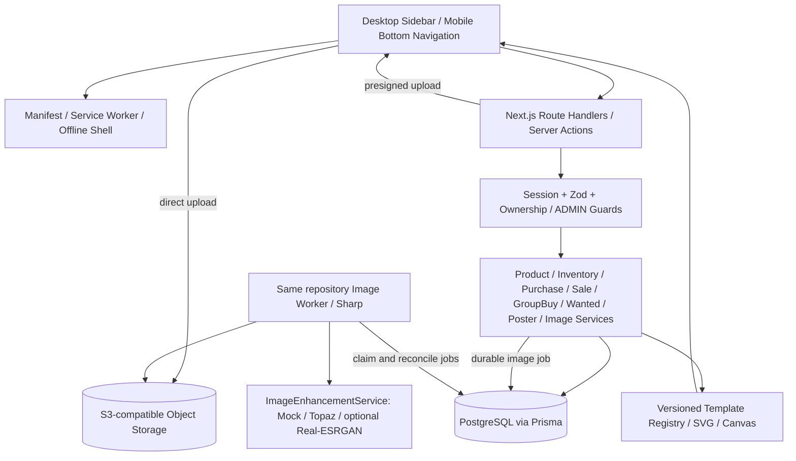

# 系统架构设计

> 更新：用户已确认设计；晚补运费立即支持，取代原 D4 限制。当前实现与实际接口见 [实施状态](implementation.md) 和 [成本调整](cost-adjustments.md)。下文保留原设计用于追溯。

本文件为待确认设计，核心口径见 [设计决策](decisions.md)。

## 1. 整体架构



单体应用，web 和 worker 共用 TypeScript domain、Prisma 和同一发布版本。worker 是同代码库命令入口，可由 Docker Compose 启动独立进程，属于耗时任务执行方式，不拆业务微服务。任务持久化在 PostgreSQL，避免依赖 HTTP 请求结束后的悬空 Promise。无 Redis、独立队列或 GPU 集群。

页面调用应用服务或 HTTP API，不直接引用 Prisma。服务负责事务和权限；repository/基础设施层处理 SQL 与外部 SDK。响应中私有数据按 session.userId 过滤，不能信任请求内 userId。

## 2. 页面与路由

|路由|功能|
|---|---|
|`/`|收藏概览：在手总数、商品种类、最近买入/卖出、在途、待排发、正在收/出|
|`/login`|多账号登录，安全 Session；管理员创建个人收藏账号|
|`/ips`|IP 图鉴入口|
|`/characters?ipId=`|角色列表|
|`/series?characterId=`|系列列表|
|`/products`|商品图鉴，支持全部周边、周边类型、周边系列三种粒度及多条件筛选|
|`/products/[id]`|大图、层级、标签、描述、我的库存/交易/收物；原图增强对比|
|`/inventory`|收藏柜按全部、类型、系列浏览，支持图卡/列表、平均成本、总成本与挂出筛选|
|`/purchases`、`/purchases/new`、`/purchases/[id]`|买入、修改/删除与库存成本重算、费用拆分、到货操作|
|`/sales`、`/sales/new`|卖出历史与实际成交|
|`/groups`、`/groups/new`、`/groups/[id]`|拼团及逐项支付/运输/到货/排发|
|`/wanted`|想收数量、已收数量、心理价、状态及收物图入口|
|`/listings`|正在出物/已完成，成交和出物图入口|
|`/posters`、`/posters/new`、`/posters/[id]/edit`|海报工坊与编辑器|
|`/transactions`|移动端买入/卖出统一入口|
|`/me`|当前账号、退出/切换、个人账号创建，以及移动端功能入口|
|`/admin` 及 `/admin/{ips,characters,series,products,tags,templates}`|ADMIN 公共图鉴、图片、模板维护|

路径统一使用小写 `/ips`，对应需求中的 `/IP`。桌面侧栏完整导航，移动底栏首页/图鉴/库存/交易/我的。触摸目标至少 44px，底部使用 safe-area-inset-bottom。筛选使用可关闭底部 Sheet，已选条件显示摘要，URL 保留筛选参数。

主视觉为浅色收藏柜、角色/商品大图、柔和强调色；库存及费用是图片旁的信息，不做 ERP 密集表格。移动海报编辑器分商品/样式/预览步骤，桌面为配置和预览双栏。所有页面有 skeleton、empty、error 和明确成功反馈。

## 3. 计划目录

```text
src/
  app/
    (auth)/login/
    (main)/{products,inventory,purchases,sales,groups,wanted,listings,posters}/
    admin/
    api/v1/
    manifest.ts
  components/{layout,product,filters,forms,poster,pwa}/
  domain/
    {product,inventory,purchase,sale,group-buy,wanted,poster,image}/
      service.ts
      schemas.ts
      types.ts
  infrastructure/
    db/{prisma.ts,transactions.ts}/
    storage/s3.ts
    enhancement/{interface,mock,topaz,realesrgan}.ts
    auth/
  poster/{renderer,layout,export,templates}/
  workers/image-worker.ts
  lib/{money,errors,dates}/
prisma/{schema.prisma,migrations,seed.ts}
public/{sw.js,offline.html,icons,fonts}/
tests/{unit,integration,e2e,fixtures}/
docs/
Dockerfile
compose.yaml
```

此树描述目标结构，不代表已创建。避免每个简单函数再拆多层接口；业务规则集中，外部能力有明确适配器即可。

## 4. PWA 方案

- manifest：name、short_name、start_url、scope、display=standalone、theme_color、background_color；192/512 PNG 与 maskable 图标，apple-touch-icon。
- Service Worker 版本化预缓存离线 HTML、图标、字体和静态壳；激活删除旧缓存。更新提示用户刷新，编辑未保存时不强刷。
- 私有 HTML、API、签名图片 URL、登录响应不进入 SW 缓存。登出清除用户相关临时状态。写操作在线执行，离线按钮解释原因，不排队成交。
- 静态资源 cache-first；导航 network-first，失败显示离线页，不返回另一个用户缓存页面。公共图片后续按明确可公开策略缓存，V1 默认不缓存 S3 签名响应。
- 生产 HTTPS，开发 localhost 测试；SW 主要在 production build 验证，开发默认禁用避免旧资源干扰。
- 验收：安装、standalone 启动、离线重开、升级、退出登录、弱网错误、六档屏宽及安全区。iOS 提供浏览器对应的手动添加说明。

## 5. 图片存储与 AI 增强

### 存储链路

1. ADMIN 请求 upload intent；后端分配随机不可变对象键、大小/类型限制和短期 presigned POST/PUT（按存储能力选）。
2. 浏览器直接上传到 S3。complete 接口仅接受 intentId，后端 HEAD/读取验证实际内容、大小、像素和所属用户，不能传任意 URL。
3. 创建原图 ImageAsset 并由 Sharp 解码、EXIF 方向校正生成独立 DISPLAY 和 THUMBNAIL；原始文件字节始终保留。上传原图默认上限 20MB、40MP，可配置并经样本验证。
4. 用户手动发起增强，ImageJob 持久化；worker 领取任务，调用 provider，输出写新 ENHANCED 对象，再生成新 DISPLAY/THUMBNAIL。
5. 派生图全部成功后以短事务切换 ProductImageSet 指针。失败记录 errorCode，保留原图及旧成功版本；迟到任务不得覆盖用户后来上传的新图集。
6. DB 引用稳定 bucket/key 和 checksum，不保存会过期的签名 URL。短期 URL 在读取时签发。上传暂存孤儿对象按 TTL 回收；仍被商品/海报快照引用的对象不可删除。

ImageJob 使用租约、attempts、nextRunAt 和 FOR UPDATE SKIP LOCKED 领取；并发初始为 1。提供 GET 状态轮询与失败重试。只有已知失败可重试；提交结果未知需用 provider requestId 核对，无法核对则 UNKNOWN 待人工处理，避免重复付费。

### Provider 抽象

```ts
interface ImageEnhancementService {
  enhance(input: ImageEnhancementInput): Promise<ImageEnhancementResult>;
}
// input: originalAssetId / trusted binary stream / model / scale /
//        requestKey / AbortSignal
// result: validated bytes / mediaType / width / height /
//         providerRequestId / modelVersion / isMock
```

环境变量 `IMAGE_ENHANCEMENT_PROVIDER=mock|topaz|realesrgan`，密钥仅服务端。provider 内部封装真实 API 的提交/查询差异，恢复状态写入 ImageJob。业务层不依赖某厂商响应。超时、限流、尺寸限制、错误码统一转换。

|方案|V1 定位|取舍|
|---|---|---|
|Topaz|建议首个真实 provider，precision 放大|无需本地模型运维；依赖 API 密钥、网络与调用额度|
|Real-ESRGAN|替换方案，待本地硬件验证后实现适配器|可本地推理；需固定模型/运行环境、控制内存与耗时|
|Mock|无密钥时的默认开发 provider|仅返回确定性测试派生图，UI 明示模拟增强；不得冒充 AI 效果|

经 2026-09-08 官方资料核对：Topaz 将 Gigapixel 定位为 precision upscaling，并列出 Art & CGI、Transparent Image Upscale 等模型；实际模型参数与端点在接入时再按当前 quickstart 核验，不假设桌面产品名称就是 API 标识。[Topaz Gigapixel](https://developer.topazlabs.com/image-models/gigapixel.md)。推荐基于本产品保真需求，不代表已完成效果或成本对比。

Real-ESRGAN 官方提供动漫插图模型 `RealESRGAN_x4plus_anime_6B` 和便携 ncnn 实现入口；插图与实物照片应使用真实样本对比后选择。[Real-ESRGAN 官方仓库](https://github.com/xinntao/Real-ESRGAN)。可选适配器通过固定可执行文件和参数数组调用，不拼接 shell 命令；临时目录仅用于处理，完成后清理，长期文件仍在 S3。

不默认启用生成人脸修复或创意重绘。可在图鉴对比原图/增强图并选择展示版本。海报只使用已选图片，不调用 AI。

## 6. SVG + Canvas 海报

PosterService 构造冻结 PosterData：商品名称、角色、系列、数量、价格、备注、图片 assetId/校验值、标题、模板版本、ratio、排序。PosterItem 保存快照，公共商品后续改名/换图不改变已保存海报。

模板 registry 提供 cute/simple/retro/minimal，数据库 PosterTemplate 存元信息、rendererKey、版本和经 Zod 验证的 config。ADMIN 可维护配置和启停，不能上传可执行 JS 或任意 SVG。业务不包含模板坐标。

Renderer 是纯函数：冻结数据 + 模板 + ratio + 固定字体度量 → SVG。图片先变为受控 data URL 嵌入，使用 contain/preserveAspectRatio，禁止拉伸。所有文字 XML escape，不使用 foreignObject。中文按字符与字体度量换行，长名称扩展卡片行高；容纳不下时明确要求减少条目，不静默裁掉文字。价格使用固定小数和币种，数量用正整数。

比例支持 1:1、4:3、3:4、16:9、9:16；长边默认 2048px，短边按比例，手机预览缩放显示。布局按比例选择列数，先计算总高度和容量。字体随应用固定版本，导出前等待字体及图片 ready，并将所需字体嵌入 SVG 或固定字形路径，避免外部加载漂移。

浏览器将 SVG Blob 加载为 Image → Canvas.drawImage → toBlob(image/png 或 image/jpeg)；JPG 先铺背景。跨域图通过服务端受控资产读取转 data URL，避免 tainted canvas。输出像素上限控制手机内存。下载失败给明确反馈；移动端支持可用时系统分享。

SVG 内容可做确定性单测；PNG 做固定浏览器环境截图测试。模板变更新增版本，旧版本保留。导出不扣库存、不自动创建 Wanted 或 Listing；显式保存并挂出才走 Listing 事务校验。
