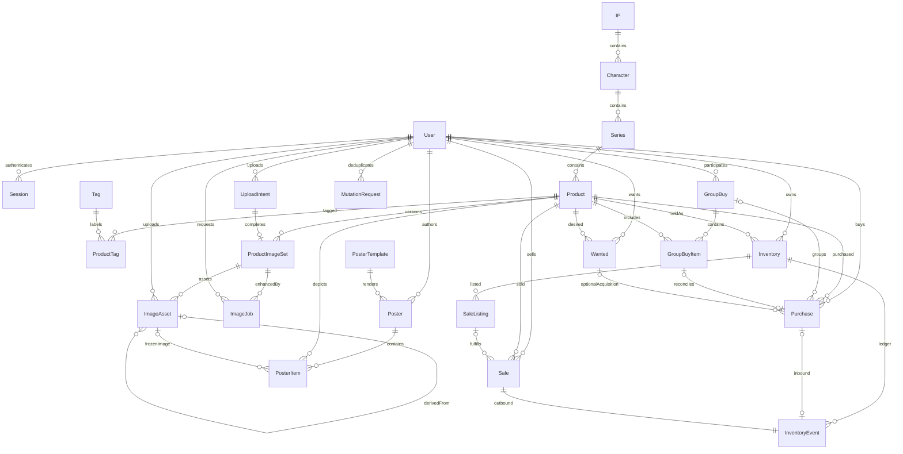

# ER Model 与数据库表结构

这是设计稿，未生成 Prisma Schema 或 migration。采用 [D1–D9 推荐口径](decisions.md)，待确认后固化。

## 通用约定

所有实体（包括关联表）使用 UUID 主键及 `createdAt/updatedAt timestamptz`；下表省略这些通用列。流水创建后不修改，updatedAt 等于 createdAt。`?` 为可空，未标注为必填；FK 表示外键。日期型 purchaseDate/saleDate 使用 date，审计时间 UTC。

金额使用 Decimal(18,2)，平均单位成本 Decimal(20,6)，不使用浮点数。V1 currency 固定 CNY。数量为整数；业务表 quantity > 0，流水 delta != 0。归档字段只用于需隐藏的主数据，交易历史不可软删除后影响求和。

用户私有根实体有 userId。服务层校验所有关联资源归属，关键父子用复合唯一约束和外键 `(parentId,userId)` 防止跨用户连接。Catalog 可多用户引用，只有 ADMIN 可写；交易相关 FK 默认 RESTRICT，禁止删除被引用商品。

## 完整 ERD

ImageSet 的指针列还分别引用本图集 ImageAsset；Product.activeImageSetId 指向该 Product 的图集。下表列出这些循环指针约束（先建空指针，再验证更新）。Wanted/Poster 通过 Product 关联，不要求存在 Inventory。

## 身份与公共图鉴

|表|字段（通用列之外）|约束/索引|
|---|---|---|
|User|email, name, passwordHash, role ADMIN/USER, status ACTIVE/DISABLED|lower(email) 唯一；密码只存强哈希，初始化交互输入|
|Session|userId FK, tokenHash, expiresAt, revokedAt?|tokenHash unique；userId/expiresAt index；cookie 保存随机 token，DB 存哈希|
|IP|name, description?, coverImageAssetId? FK ImageAsset, sortOrder=0, status ACTIVE/ARCHIVED|规范化 name unique；status/sortOrder index|
|Character|ipId FK, name, description?, avatarAssetId? FK, sortOrder=0, status|unique(ipId,name)；ipId/status index|
|Series|characterId FK, name, description?, coverImageAssetId? FK, sortOrder=0, status|unique(characterId,name)；characterId/status index|
|Product|seriesId FK, name, appearanceKey, description?, productType, activeImageSetId? FK, status|unique(seriesId,appearanceKey,name,productType)；seriesId/status、productType/status index|
|Tag|name, color?, status ACTIVE/ARCHIVED|规范化 name unique|
|ProductTag|productId FK, tagId FK|unique(productId,tagId)；tagId/productId index|

ProductType 初始 BADGE/STANDEE/POSTCARD/BONUS/KEYCHAIN/PLUSH/OTHER，用 enum 并显示中文。年份可出现在描述/标签，不强制成为层级。appearanceKey 是管理员可读的形象标识，不是 AI 识别结果。

Product API 返回 `originalImage/enhancedImage/thumbnailImage/coverImage`，物理存储通过 ImageSet/Asset 规范化，避免多个字符串 URL 指向不一致版本。IP/角色/系列封面复用 ImageAsset，可无 ProductImageSet；上传目标明确限定类别和资源 ID。

## 图片

|表|字段|约束/索引|
|---|---|---|
|UploadIntent|userId FK, targetType, targetId UUID, bucket, objectKey, expectedMime, maxBytes, status PENDING/COMPLETED/EXPIRED/FAILED, expiresAt, errorCode?|objectKey unique；userId/status、expiresAt index；target 在服务层按类型校验|
|ProductImageSet|productId FK, uploadIntentId FK, version, originalAssetId? FK, enhancedAssetId? FK, displayAssetId? FK, thumbnailAssetId? FK, selectedSource ORIGINAL/ENHANCED, status PROCESSING/READY/FAILED/ARCHIVED|unique(productId,version)、uploadIntentId unique；READY 必须有原图/展示/缩略图|
|ImageAsset|userId FK, imageSetId? FK, sourceAssetId? FK, kind ORIGINAL/ENHANCED/DISPLAY/THUMBNAIL, bucket, objectKey, mimeType, bytes BigInt, width, height, checksum, provider?, modelVersion?, isMock=false, status ACTIVE/ARCHIVED|unique(bucket,objectKey)；imageSetId/kind index；内容不可变|
|ImageJob|userId FK, imageSetId FK, originalAssetId FK, kind DERIVE/ENHANCE, provider, model?, parameters JSON, status, providerRequestId?, attempt=0, maxAttempts=3, nextRunAt, leaseUntil?, leaseToken?, errorCode?, errorMessage?, resultAssetId? FK, startedAt?, finishedAt?, requestKey|unique(userId,requestKey)；status/nextRunAt、leaseUntil index|

ImageJob.status = QUEUED/RUNNING/SUCCEEDED/FAILED/UNKNOWN。创建 intent 完成时，图集与原图及 DERIVE job 同一 DB 事务；S3 不参加 DB 事务，用暂存和回收修复孤儿对象。图集 READY 后才可设为 active。指针必须属于相同 imageSet，源图必须 ORIGINAL；使用服务校验和可实现的复合 FK。图片原件禁止覆盖或更新 objectKey。

## 库存与交易

|表|字段|约束/索引|
|---|---|---|
|Inventory|userId FK, productId FK, currentQuantity=0, currentCost=0, version=0, status ACTIVE/ARCHIVED|unique(userId,productId)；productId index；quantity/cost >= 0；unique(id,userId)|
|InventoryEvent|inventoryId FK, type BUY/SELL/GIFT/EXCHANGE/LOSS/ADJUSTMENT, quantityDelta, costDelta, purchaseId? FK, saleId? FK, reversalOfId? FK self, reason?, occurredAt, actorUserId FK, requestId FK MutationRequest|purchaseId unique、saleId unique；inventoryId/createdAt、createdAt index；BUY>0、SELL/LOSS<0；来源约束|
|Purchase|userId FK, productId FK, quantity, unitPrice, productAmount, domesticShipping=0, internationalShipping=0, otherFee=0, actualCost, currency=CNY, purchaseChannel, purchaseDate, arrivalStatus PENDING/SHIPPED/ARRIVED/CANCELLED, arrivedAt?, groupBuyId? FK, groupBuyItemId? FK, wantedId? FK, notes?, costLockedAt?, version=0|groupBuyItemId unique；userId/purchaseDate、productId、groupBuyId、userId/arrivalStatus index；非负费用，金额公式约束|
|SaleListing|inventoryId FK, userId FK, quantity, remainingQuantity, unitPrice, status ACTIVE/COMPLETED/CANCELLED, notes?, version=0|0<=remaining<=quantity；部分 unique(inventoryId) WHERE status=ACTIVE；userId/status index；复合 FK 保证归属|
|Sale|userId FK, productId FK, listingId? FK, quantity, unitPrice, totalAmount, allocatedActualCost, saleChannel, saleDate, currency=CNY, notes?|userId/saleDate、productId、listingId index；amount>=0；成本快照不可变|
|MutationRequest|userId FK, operation, key, requestHash, resultType?, resultId?, response JSON?, status PROCESSING/SUCCEEDED|unique(userId,operation,key)；业务变更和结果在同一事务提交|

库存是实物推荐口径：`currentQuantity = SUM(quantityDelta)`，`currentCost = SUM(costDelta)`，averageCost 为 currentCost/currentQuantity（零库存显示 0），不单独维护重复的均价列。Inventory 查询缓存与流水必须同事务修改。

到货成本 +actualCost；卖出分摊成本 `round(currentCost * quantity/currentQuantity, 2)`，最后全部卖完取剩余全部成本，消除分币残差。Sale 保存分摊值，Event.costDelta 为其负值。盈利 = totalAmount - allocatedActualCost，不用 Product 历史总成本。

GIFT/LOSS 出库按同样平均成本；正向 GIFT/ADJUSTMENT 必须明确输入成本（允许 0）和原因。EXCHANGE 以带共同 requestId 的进出事件表达，同事务锁定相关库存，锁顺序按 id 排序避免死锁。上述扣减均保护 ACTIVE Listing 数量，不足时要求先减少挂出。

## 拼团与收物

|表|字段|约束/索引|
|---|---|---|
|GroupBuy|userId FK, name, description?, groupOwner, openTime?, closeTime?, status OPEN/CLOSED/COMPLETED/CANCELLED, notes?|userId/status、userId/createdAt index；closeTime>=openTime；unique(id,userId)|
|GroupBuyItem|userId FK, groupId FK, productId FK, quantity, unitPrice, paymentStatus UNPAID/PAID, shippingStatus NOT_SHIPPED/SHIPPED, dispatchStatus NOT_DISPATCHED/DISPATCHED, notes?|groupId、productId、groupId/dispatchStatus index；允许同商品多条批次；unique(id,userId)|
|Wanted|userId FK, productId FK, wantedQuantity, fulfilledQuantity=0, targetPrice?, priority LOW/NORMAL/HIGH, status WANTED/PARTIAL/FULFILLED/CANCELLED, notes?, version=0|userId/status、productId index；0<=fulfilled<=wanted；每商品一个活跃 Wanted 的部分唯一索引|

GroupBuyItem.quantity/unitPrice 仅在尚未关联 Purchase 时作为计划值；创建 Purchase 时复制，关联后不独立编辑，详情返回 Purchase 数量/价格投影。更严格的替代是完全去掉 Item 计划金额列并要求建团项即建 Purchase，留待 D3 确认。`arrivalStatus` 不重复存储在 Item，依据 Purchase 投影 NOT_ARRIVED/ARRIVED/CANCELLED；尚无 Purchase 为 NOT_ARRIVED。Purchase.groupBuyId 冗余方便检索，事务校验它等于 GroupBuyItem.groupId。

Wanted 的已收数可手动标记，不必存在买入凭证。选择“记录买入并更新已收”时 Purchase.wantedId 关联，到货时才增加 fulfilledQuantity，幂等请求保证一次；超过目标拒绝并提示先增加目标，不截断。

## 海报

|表|字段|约束/索引|
|---|---|---|
|PosterTemplate|key, version, name, rendererKey, defaultConfig JSON, status ACTIVE/ARCHIVED|unique(key,version)；不可修改已引用的 renderer 版本|
|Poster|userId FK, type SALE/WANTED, ratio enum, templateId FK, templateConfig JSON, title, status DRAFT/SAVED/ARCHIVED, version=0|userId/type、userId/updatedAt index|
|PosterItem|posterId FK, productId FK, imageAssetId? FK, quantity, price?, note?, sortOrder, productSnapshot JSON|unique(posterId,sortOrder)；productId index；quantity>0、price>=0；snapshot schema 版本必填|

ratio 枚举 SQUARE/FOUR_THREE/THREE_FOUR/SIXTEEN_NINE/NINE_SIXTEEN。price=null 表示“可议/未填写”，不能当 0 元；业务金额未知也必须与 0 区分。Snapshot 包含商品/角色/系列名称和固定图片标识，避免图鉴编辑破坏海报再现。无图片使用确定性占位图并在导出前提示。

## 约束与迁移策略

- Prisma 表达基本 FK、唯一性和索引；部分唯一索引、CHECK 和需要的锁 SQL 以审阅过的 migration SQL 实现。
- `(inventoryId,userId)` 等复合 FK 防止私有表跨账号引用；Sale 的 productId 必须等于 Listing 对应商品，到货 Event 必须对应 Purchase 商品。
- 交易与 Event 一一对应属于跨表不变量：所有写入统一服务事务，DB 约束阻止重复来源，集成测试和核对查询发现缺失。不得宣称单凭 FK 能强制“每 Sale 必有 Event”。
- 不创建 Product→Inventory→Wanted 的强制链，收物本来可以零库存；GroupItem 也直接连 Product。
- 列表游标 `(createdAt,id)` 保证稳定分页；初始关键词大小写无关匹配，中文数据增大时通过评估增加 pg_trgm，V1 不另建搜索服务。
- 初始化 migration 在空 PostgreSQL 验证；后续 migration 在上一个版本和有样本数据的 DB 验证；种子数据仅示例元数据，不含 API 密钥或固定管理员密码。
