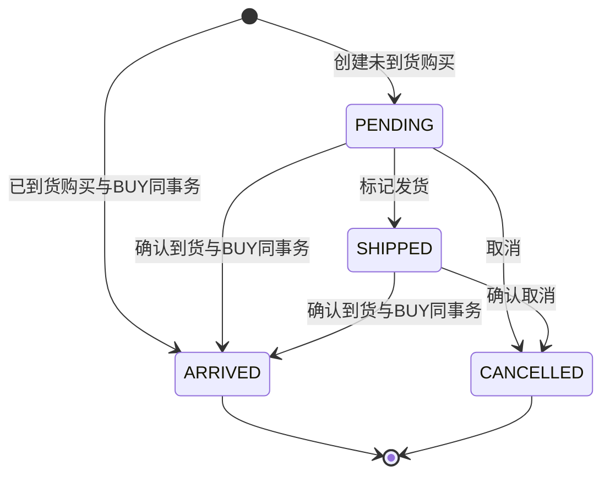
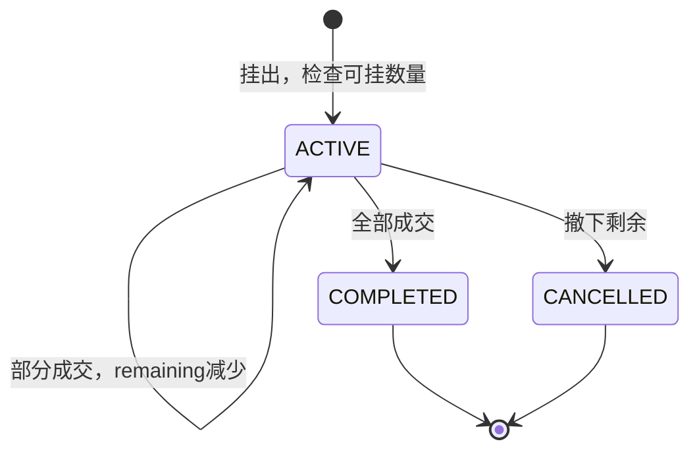
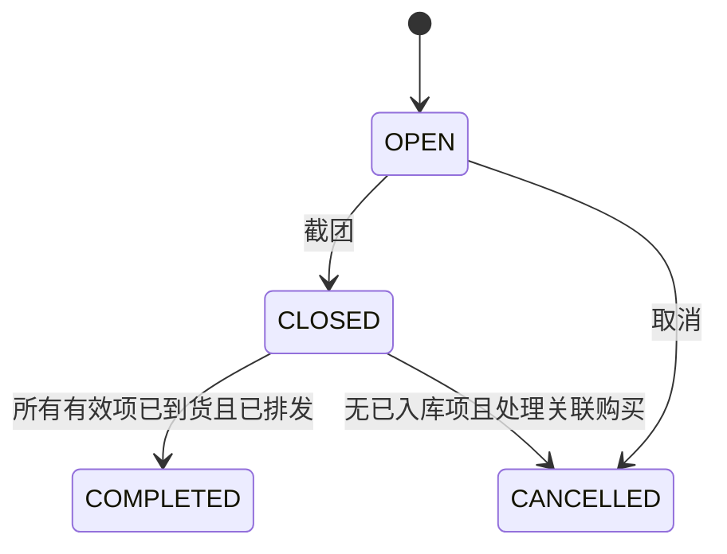
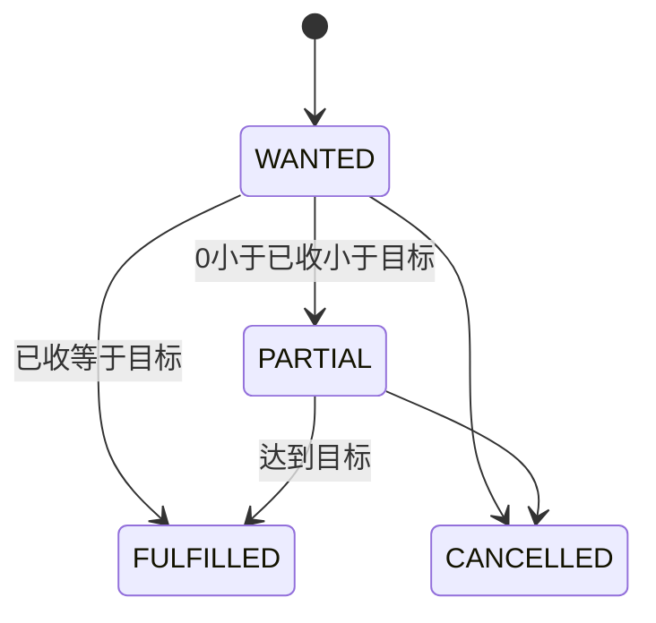
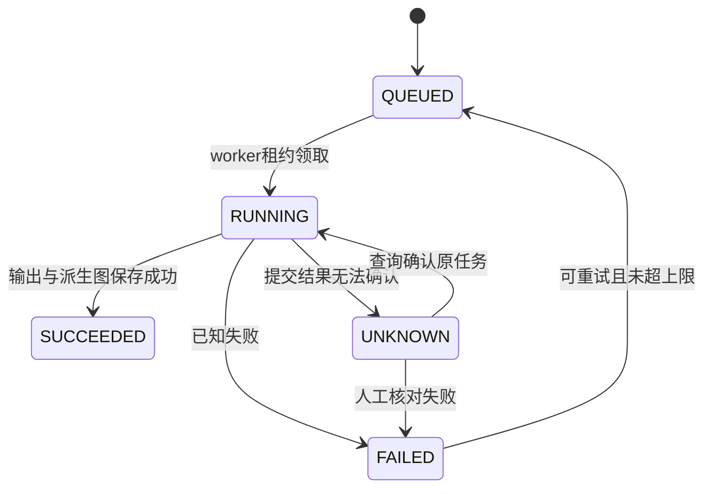
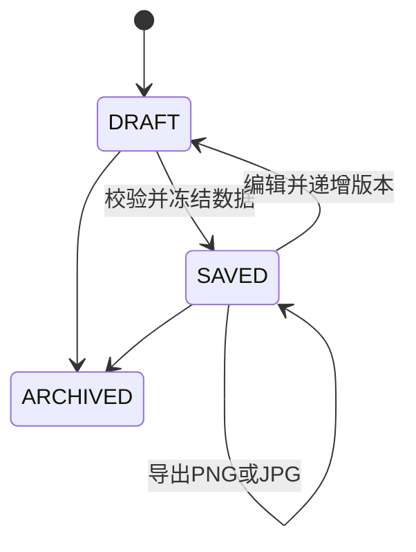

# 核心业务流程和状态机

以下采用待确认的实物库存口径。任何私有操作先认证、校验所有权及 Zod 输入，再进入服务层。变更请求有 Idempotency-Key；相同 key 不同 payload 返回 409。并发先锁 Inventory，再锁关联 Listing/Wanted，统一锁顺序。

## 买入与到货

PurchaseService.create：算 productAmount=quantity×unitPrice，actualCost=四项之和；客户端传回的总计不作为事实。未到货只记 Purchase，显示在途。已到货则创建/锁 Inventory、写 BUY、加数量及成本、设置 costLockedAt，同事务提交。

PurchaseService.arrive：锁 Purchase 并判断尚未 ARRIVED/CANCELLED，锁 Inventory，写唯一 purchaseId 的 BUY、更新缓存和 Purchase。来自 Wanted 且显式选择组合动作时同步更新已收。重复点击不重复入库。V1 不支持部分到货；分批买入可拆独立 Purchase/GroupItem。

## 卖出与挂出

创建 Listing 不写库存事件。撤下也不写库存事件。编辑目标挂出量时锁 Inventory，不能超过在手量。COMPLETED 仅用于全部成交；撤下的剩余数保留作为历史，活跃挂出总数只统计 ACTIVE。

SaleService.sell 同一事务：

1. 校验 quantity>0、价格非负、所属商品；锁 Inventory 及指定 Listing。
2. 确保 quantity<=currentQuantity；关联 Listing 时不能超其 remaining。无关联时只能卖 currentQuantity-activeListedQuantity。
3. 计算移动平均分摊，创建 Sale 成本快照。
4. 写 SELL(-quantity,-allocatedActualCost)，更新 Inventory 缓存；关联 Listing 同步减少 remaining，归零则 COMPLETED。
5. 保存幂等结果，提交。任何失败全部回滚，序列化冲突进行有限重试。

例：到货 3 件，总成本 30；挂出 2，库存仍 3；关联成交 1 件 15 元，库存 2、挂出 1、剩余成本 20、该次利润 5。库存 2 卖 3 必须失败。两次并发卖 2 件时至多一个成功。

## 拼团

逐项维护 PAID/UNPAID、SHIPPED/NOT_SHIPPED、DISPATCHED/NOT_DISPATCHED；推荐 shippingStatus 表示团内上游运输，dispatchStatus 表示团长向本人排发。ARRIVED 指本人收到，以关联 Purchase 为准。不是用一个总状态覆盖所有团项。

取消团不能删除购买；若有已到货记录拒绝整团取消，可关闭团并保留历史。未到货关联购买由明确的批量取消动作在事务内处理。状态纠错有版本校验与操作原因；已关联购买数量/金额通过 PurchaseService 改动。

## 收物

状态按 fulfilledQuantity 推导，取消独立保留。创建 Wanted 不写 InventoryEvent。“仅更新已收”明确不变库存；“记录收到并买入”执行 Purchase + BUY + Wanted 更新同一事务。重复补记可能导致用户语义上的重复，因此表单展示已有相关购买并要求显式选择，不暗中同步。

## 图片任务

worker 崩溃后按租约恢复，先核对已有 requestId。原图从未进入覆盖操作；只有当前图集和当前任务仍有效时更新派生指针。失败可查看原因与重试，旧增强图继续可用。

## 海报

收物图从 Catalog 选品，不查库存资格。出物图保存时校验当前库存，导出历史海报不反向修改交易。“保存并挂出”在一个事务内保存 Poster 并创建/明确更新 Listing；已有活跃 Listing 时提示复用或编辑，不默认叠加。独立导出仅使用冻结数据，用户再次发布前展示库存已变提示。
